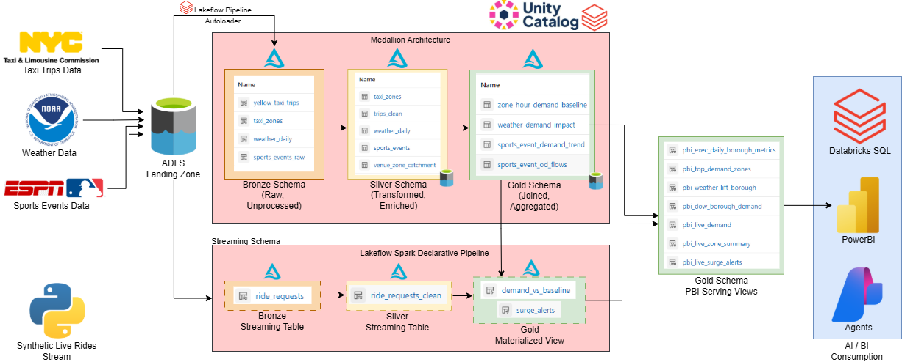
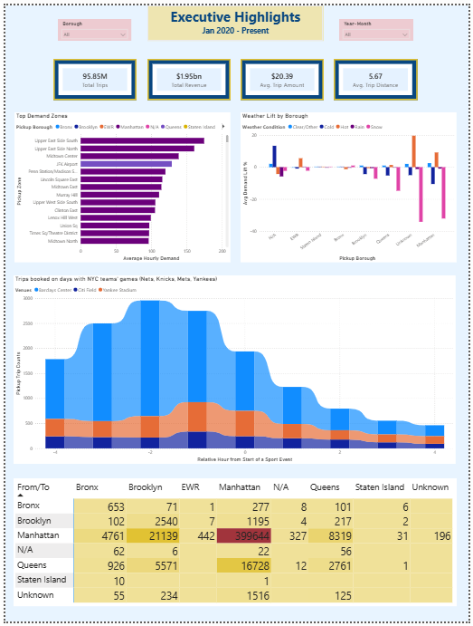
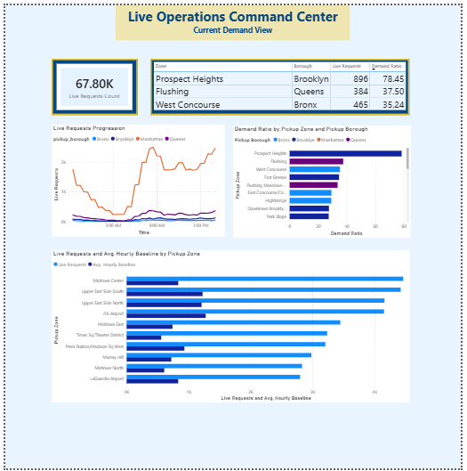

<h1 align="center">🚕 NYC Taxi Lakehouse</h1>

<p align="center">
  <strong>An end-to-end Databricks Lakehouse analyzing NYC's yellow taxi trips, and understanding how weather & sports events shape NYC taxi demand.</strong>
</p>

<p align="center">
  <a href="#"></a>
  <a href="#"></a>
  <a href="#"></a>
  <a href="#"></a>
  <a href="#"></a>
</p>

---

## Table of Contents

1. [Scenario](#scenario)
2. [Architecture](#architecture)
3. [Lab Guide](#lab-guide)
   - [Prerequisites](#prerequisites)
   - [Step 1: Create an Azure Databricks Workspace](#step-1-create-an-azure-databricks-workspace)
   - [Step 2: Create an ADLS Gen2 Storage Account](#step-2-create-an-adls-gen2-storage-account)
   - [Step 3: Configure the Access Connector (Managed Identity)](#step-3-configure-the-access-connector-managed-identity)
   - [Step 4: Create the Unity Catalog and Schemas](#step-4-create-the-unity-catalog-and-schemas)
   - [Step 5: Clone the Repository into Your Workspace](#step-5-clone-the-repository-into-your-workspace)
   - [Step 6: Configure the Config Notebook](#step-6-configure-the-config-notebook)
   - [Step 7: Set Up Azure Key Vault + Secret Scope](#step-7-set-up-azure-key-vault--secret-scope)
   - [Step 8: Run the Bootstrap Notebook](#step-8-run-the-bootstrap-notebook)
   - [Step 9: Set Up the Bronze Ingestion Pipeline](#step-9-set-up-the-bronze-ingestion-pipeline)
   - [Step 10: Run the Silver Transformations](#step-10-run-the-silver-transformations)
   - [Step 11: Run the Gold Tables](#step-11-run-the-gold-tables)
   - [Step 12: Set Up the Live Ride Generator](#step-12-set-up-the-live-ride-generator)
   - [Step 13: Set Up the Streaming Ingestion Pipeline](#step-13-set-up-the-streaming-ingestion-pipeline)
   - [Step 14: Set Up the PowerBI Serving Views](#step-14-set-up-the-powerbi-serving-views)
   - [Step 15: Schedule the Batch Processing Job](#step-15-schedule-the-batch-processing-job)
   - [Step 16: Connect PowerBI via DirectQuery](#step-16-connect-powerbi-via-directquery)
4. [PowerBI Dashboards](#powerbi-dashboards)
5. [Conversational Analytics with Genie](#conversational-analytics-with-genie)
6. [Design Optimizations](#design-optimizations)
7. [Azure Infrastructure](#azure-infrastructure)
8. [Project Structure](#project-structure)
9. [Contributing](#contributing)
10. [Acknowledgments](#acknowledgments)

---

## Scenario

You are a **mobility operator** studying NYC taxi data to streamline and improve operations. Your data team needs to answer questions like:

- Which zones and boroughs normally have the most demand?
- How do weather conditions and sports events affect ride demand?
- What is the live demand right now?
- Which zones are currently seeing higher-than-normal demand?

To answer these, you'll build a unified lakehouse on Azure Databricks that ingests historical taxi trip data alongside weather and sports event feeds, processes them through a medallion architecture, and surfaces insights through both a PowerBI executive dashboard and a conversational Genie agent — giving your operations team both at-a-glance visuals and the ability to ask ad-hoc questions in plain English.

---

## Architecture

<p align="center">
  
</p>

This lakehouse is built on two parallel processing paths, unified under Unity Catalog governance:

### Batch Processing Layer

External data sources (NYC TLC trip Parquet files, NOAA weather JSON, ESPN sports events) land in an ADLS Gen2 landing zone. A **Lakeflow Spark Declarative Pipeline** with **Auto Loader** incrementally ingests new files into Bronze streaming tables, where they are then cleaned and enriched through Silver, and aggregated into Gold analytical tables. This pipeline runs on a daily batch schedule.

### Streaming Processing Layer

A Python-based **live ride generator** produces synthetic real-time ride requests that flow into a separate streaming SDP pipeline. This hot path processes rides through its own Bronze → Silver → Gold chain (`ride_requests` → `ride_requests_clean` → `demand_vs_baseline` + `surge_alerts`), providing near-real-time operational awareness without impacting the batch layer.

### Consumption Layer

Seven pre-aggregated **PowerBI serving views** in the Gold schema are optimized for DirectQuery access against a Serverless SQL Warehouse. This enables:

- **PowerBI dashboards** — Executive Highlights (historical trends) and Live Operations Command Center (real-time surge detection)
- **Databricks SQL** — Ad-hoc analyst queries
- **Genie agents** — Conversational natural-language analytics over the lakehouse

---

## Lab Guide

### Prerequisites

- An active **Azure Subscription** with Contributor access
- Azure CLI installed locally (or use Azure Cloud Shell)
- A resource group created for this project (e.g., `rg-nyc-taxi-lakehouse`)

---

### Step 1: Create an Azure Databricks Workspace

1. In the Azure Portal, search for **Azure Databricks** and click **Create**
2. Select your resource group, name the workspace (e.g., `dbw-nyc-taxi-lakehouse`), and choose your preferred region
3. Select the **Premium** pricing tier (required for Unity Catalog)
4. Click **Review + Create**, then **Create**
5. Once deployed, launch the workspace

---

### Step 2: Create an ADLS Gen2 Storage Account

1. In the Azure Portal, search for **Storage accounts** and click **Create**
2. Select the same resource group and region as your Databricks workspace
3. Name the account (e.g., `stnyctaxilakehouse`) — must be globally unique, lowercase, no hyphens
4. Under the **Advanced** tab, check **Enable hierarchical namespace** (this makes it ADLS Gen2)
5. Leave other defaults and click **Review + Create**
6. Once created, go to the storage account → **Containers** → create a container named `taxicompany`

---

### Step 3: Configure the Access Connector (Managed Identity)

The Access Connector allows Azure Databricks to securely access your ADLS storage using a managed identity — no keys or secrets required.

**Create the Access Connector:**

1. In the Azure Portal, search for **Access Connector for Azure Databricks** and click **Create**
2. Select the same resource group, name it (e.g., `ac-nyc-taxi-lakehouse`), and choose the same region
3. Leave the identity type as **System Assigned**
4. Click **Review + Create**

**Assign storage roles to the connector:**

1. Go to your ADLS storage account → **Access Control (IAM)** → **Add role assignment**
2. Assign the following roles to the access connector's managed identity:
   - **Storage Account Contributor**
   - **Storage Blob Data Contributor**
   - **Storage Queue Data Contributor**
   - **EventGrid EventSubscription Contributor**
3. Click **Review + Assign**

**Configure the connector in Databricks:**

1. In your Databricks workspace, go to **Catalog** → **External Locations** → **Create Storage Credential**
2. Select **Azure Managed Identity** and paste the Access Connector resource ID:
   ```
   /subscriptions/<sub-id>/resourceGroups/<rg>/providers/Microsoft.Databricks/accessConnectors/<connector-name>
   ```
3. Create an **External Location** pointing to your container:
   ```
   abfss://taxicompany@<your-storage-account>.dfs.core.windows.net/
   ```

> 📹 For a detailed video walkthrough of this setup, see: (https://www.youtube.com/watch?v=kRfNXFh9T3U)

---

### Step 4: Create the Unity Catalog and Schemas

In your Databricks workspace, open a SQL editor or notebook and run:

```sql
-- Create the catalog
CREATE CATALOG IF NOT EXISTS nyc_taxi_company;
USE CATALOG nyc_taxi_company;

-- Create schemas for each medallion layer
CREATE SCHEMA IF NOT EXISTS bronze;
CREATE SCHEMA IF NOT EXISTS silver;
CREATE SCHEMA IF NOT EXISTS gold;
CREATE SCHEMA IF NOT EXISTS streaming;
CREATE SCHEMA IF NOT EXISTS governance;
```

Ensure the External Location you created in Step 3 is accessible from this catalog.

---

### Step 5: Clone the Repository into Your Workspace

Now that your Azure infrastructure is ready, bring all the project code into your workspace at once:

1. In the Databricks sidebar, click **Workspace** → navigate to your user folder
2. Click the **⋮** menu → **Create** → **Git Folder**
3. Paste the repo URL: `https://github.com/<your-username>/nyc-taxi-lakehouse.git`
4. Click **Create Git Folder**

This creates a synced folder containing all notebooks, pipeline definitions, and configuration files in the correct project structure. All subsequent steps reference files from this folder.

> 💡 The `%run ./00_config` references in each notebook work because all notebooks live in the same `notebooks/` directory.

The bootstrap notebook (Step 8) will automatically create the following ADLS folder structure when it runs:

```
taxicompany/
├── landing/
│   ├── nyc_taxi/yellow/        # Monthly Parquet trip files (partitioned by year/month)
│   ├── nyc_taxi/zones/         # Taxi zone lookup CSV
│   ├── weather/                # NOAA daily JSON files (one per year)
│   ├── events/                 # Sports event data
│   └── synthetic/live_ride_requests/  # Streaming ride simulator output
├── curated/
│   ├── bronze/                 # Delta tables (raw ingestion)
│   ├── silver/                 # Delta tables (cleaned, enriched)
│   └── gold/                   # Delta tables (aggregated analytics)
├── checkpoints/                # Structured Streaming checkpoints
└── quarantine/                 # Records that failed quality checks
```

---

### Step 6: Configure the Config Notebook

Open `notebooks/00_config` and update the storage account name to match yours:

```python
CATALOG = "nyc_taxi_company"

STORAGE_ACCOUNT = "<your-storage-account>"   # e.g., "stnyctaxilakehouse"
CONTAINER = "taxicompany"

BASE_PATH = f"abfss://{CONTAINER}@{STORAGE_ACCOUNT}.dfs.core.windows.net"

LANDING_PATH = f"{BASE_PATH}/landing"
CURATED_PATH = f"{BASE_PATH}/curated"
CHECKPOINT_PATH = f"{BASE_PATH}/checkpoints"
QUARANTINE_PATH = f"{BASE_PATH}/quarantine"

BRONZE_SCHEMA = f"{CATALOG}.bronze"
SILVER_SCHEMA = f"{CATALOG}.silver"
GOLD_SCHEMA = f"{CATALOG}.gold"
STREAMING_SCHEMA = f"{CATALOG}.streaming"
```

Update `STORAGE_ACCOUNT` with the name from Step 2. All other notebooks reference this config via `%run ./00_config`.

---

### Step 7: Set Up Azure Key Vault + Secret Scope

Before running the bootstrap, you need a NOAA API token stored securely. The bootstrap notebook retrieves it from a Databricks secret scope backed by Azure Key Vault:

1. Go to [NOAA's website](https://www.ncdc.noaa.gov/cdo-web/token) and register your email address to receive an access token. For best practice, you need to protect this and not expose it directly within your code.
2. **Create an Azure Key Vault** in the same resource group
3. Add a secret named `NOAA-CDO` with your NOAA CDO API token as the value
4. In Databricks, create a **secret scope** named `weather-data` backed by this Key Vault:
    - Go to `https://<your-workspace-url>#secrets/createScope`
    - Set the scope name to `weather-data`
    - Paste the Key Vault DNS name and Resource ID
5. Verify access: `dbutils.secrets.get(scope="weather-data", key="NOAA-CDO")`

---

### Step 8: Run the Bootstrap Notebook

Open and run `notebooks/00_setup_bootstrap`. This notebook is **idempotent** — safe to re-run at any time. It will:

1. Create the ADLS folder structure
2. Download NYC TLC Yellow Taxi Parquet files (2020–present, ~3.6 GB)
3. Download the TLC taxi zone lookup CSV (263 zones)
4. Download NOAA daily weather data from Central Park station (2020–present)
5. Download curated NYC sports events data

> ⏱️ **First run takes approximately 10–15 minutes** depending on network speed. Subsequent runs skip already-downloaded files.

---

### Step 9: Set Up the Bronze Ingestion Pipeline

This step uses a **Spark Declarative Pipeline (SDP)** — Databricks' framework for building reliable, incremental data pipelines declaratively. Instead of writing manual orchestration logic, you define *what* your tables should look like and SDP handles the *how* (checkpointing, retries, schema evolution, data quality).

The pipeline uses **Auto Loader** (`cloudFiles`) as its ingestion source. Auto Loader efficiently discovers and processes new files as they arrive in your landing zone — it tracks which files have already been ingested via an internal checkpoint, so it never reprocesses data.

**To create the pipeline:**

1. In your Databricks workspace, go to **Pipelines** → **Create Pipeline**
2. Name it `NYC Taxi Bronze Ingestion`
3. Set the **Target catalog** to `nyc_taxi_company` and **Target schema** to `bronze`
4. Add the pipeline source notebook(s) from `pipelines/nyc_taxi_bronze_ingestion/transformations/`
5. Click **Start** to run the initial ingestion

This pipeline creates the following Bronze streaming tables:
- `yellow_taxi_trips` — Raw trip records from monthly Parquet files
- `taxi_zones` — Zone lookup reference data
- `weather_daily` — NOAA daily weather observations
- `sports_events_raw` — Sports event schedule data

> 💡 Auto Loader detects new files automatically on subsequent runs — no manual re-triggers needed for the batch sources.

---

### Step 10: Run the Silver Transformations

Open and run `notebooks/02_silver_transformations`. This notebook reads from Bronze tables and produces cleaned, validated, and enriched Silver tables:

| Silver Table | Source | Key Transformations |
| --- | --- | --- |
| `taxi_zones` | Bronze zones | Standardized columns, added `is_airport` and `is_manhattan` flags |
| `trips_clean` | Bronze trips + Silver zones | Quality filters (date, duration, distance, fare), zone enrichment via JOIN, SHA-256 trip IDs |
| `weather_daily` | Bronze weather | Pivot from long to wide format, temperature categorization, weather condition classification |
| `sports_events` | Bronze events | Timestamp parsing, estimated end times, analysis window calculation (±4 hours) |
| `venue_zone_catchment` | Silver zones + venue config | Maps each venue to nearby taxi pickup zones for event impact analysis |

---

### Step 11: Run the Gold Tables

Open and run `notebooks/03_gold_tables`. This notebook aggregates Silver data into analytics-ready Gold tables:

| Gold Table | Purpose |
| --- | --- |
| `zone_hour_demand_baseline` | Historical average and P90 demand by zone × hour × day-of-week × month. The "expected normal" for any given time slot. |
| `weather_demand_impact` | Actual daily demand joined with weather conditions, compared against the baseline to compute demand lift/drop percentages. |
| `sports_event_demand_trend` | Hourly demand curve from −4h to +4h around each sporting event, per catchment zone, with baseline comparison. |
| `sports_event_od_flows` | Origin-destination trip matrix on event days showing borough-to-borough flow patterns. |

These tables power both the PowerBI dashboards and Genie conversational queries.

---

### Step 12: Set Up the Live Ride Generator

Open and run `notebooks/04_live_ride_generator`. This notebook simulates a real-time stream of taxi ride requests by generating synthetic ride events and writing them as JSON files to the landing zone at `landing/synthetic/live_ride_requests/`.

Each generated ride includes a pickup zone, timestamp, passenger count, and estimated fare — mimicking what a live dispatch system would produce. The generator writes micro-batches of files continuously, providing a realistic streaming source for the hot path pipeline.

> 💡 Keep this notebook running in a separate session while you want the streaming pipeline to have fresh data to process.

---

### Step 13: Set Up the Streaming Ingestion Pipeline

This is a **separate SDP pipeline** from the batch Bronze pipeline (Step 9), dedicated to the real-time hot path.

**What it does:**

The streaming pipeline processes live ride requests through its own medallion chain:

| Layer | Table | Description |
| --- | --- | --- |
| Bronze | `ride_requests` | Raw streaming table ingesting JSON files via Auto Loader |
| Silver | `ride_requests_clean` | Validated and standardized ride requests |
| Gold | `demand_vs_baseline` | Materialized view comparing live demand to historical baseline |
| Gold | `surge_alerts` | Materialized view flagging zones with abnormally high demand |

**To create the pipeline:**

1. Go to **Pipelines** → **Create Pipeline**
2. Name it `NYC Taxi Live Streaming`
3. Set the **Target catalog** to `nyc_taxi_company` and **Target schema** to `streaming`
4. Add the pipeline source notebook(s) from `pipelines/nyc_taxi_live_streaming/transformations/`
5. Set the pipeline mode to **Continuous** (for near-real-time processing) or **Triggered** (for periodic micro-batches)
6. Click **Start**

> ⚠️ **Cost note:** Continuous mode keeps a cluster running 24/7. For lab purposes, use Triggered mode and manually start updates when the ride generator is running.

---

### Step 14: Set Up the PowerBI Serving Views

Open and run `notebooks/05_powerbi_serving_views`. This notebook creates seven **pre-aggregated views** in the Gold schema, optimized for PowerBI DirectQuery performance:

| View | Purpose |
| --- | --- |
| `pbi_exec_daily_borough_metrics` | Daily KPIs by borough (trips, revenue, avg fare, avg distance) |
| `pbi_top_demand_zones` | Top pickup zones ranked by average hourly demand |
| `pbi_weather_lift_borough` | Weather condition impact on demand by borough |
| `pbi_dow_borough_demand` | Day-of-week demand patterns by borough |
| `pbi_live_demand` | Current live ride request counts (from streaming layer) |
| `pbi_live_zone_summary` | Live demand aggregated by zone with baseline comparison |
| `pbi_live_surge_alerts` | Active surge alerts for operations team |

These views are intentionally **pre-aggregated** so that PowerBI's DirectQuery calls hit lightweight, fast-returning queries against the Serverless SQL Warehouse rather than scanning raw fact tables.

---

### Step 15: Schedule the Batch Processing Job

Create a Lakeflow Job to orchestrate the full batch pipeline on a daily cadence:

1. In your Databricks workspace, go to **Jobs** → **Create Job**
2. Name it `NYC Taxi Lakehouse - Daily Batch Pipeline`
3. Add the following **4 tasks** as a linear DAG:

| Task Key | Type | Asset | Description |
| --- | --- | --- | --- |
| `bootstrap_data` | Notebook | `00_setup_bootstrap` | Downloads any new monthly taxi, weather, and events data to ADLS |
| `bronze_ingestion` | Pipeline | `NYC Taxi Bronze Ingestion` | Triggers the SDP pipeline to ingest new landing zone files |
| `silver_transforms` | Notebook | `02_silver_transformations` | Rebuilds Silver curated tables |
| `gold_tables` | Notebook | `03_gold_tables` | Rebuilds Gold analytical tables |

4. Set dependencies: `bootstrap_data` → `bronze_ingestion` → `silver_transforms` → `gold_tables`
5. Under **Schedule**, set to run **daily** (e.g., 2:00 AM UTC) or at your preferred cadence
6. Under **Compute**, assign a job cluster (e.g., `Standard_D4ds_v5` with Photon enabled)
7. Click **Create**

> 💡 The batch job handles the historical/analytical path only. The streaming pipeline (Step 13) runs independently for real-time demand monitoring.

---

### Step 16: Connect PowerBI via DirectQuery

The PowerBI serving views (Step 14) are designed to be consumed through **DirectQuery** against a Databricks **Serverless SQL Warehouse**. Each time a user interacts with the dashboard — filtering, drilling down, or refreshing a page — PowerBI sends a live SQL query to the warehouse and returns fresh results.

**Set up the connection:**

1. In your Databricks workspace, go to **SQL Warehouses** → ensure you have a **Serverless** warehouse running (or create one)
2. Click the warehouse → **Connection Details** — copy the **Server hostname** and **HTTP path**
3. In PowerBI Desktop, go to **Get Data** → search for **Databricks** → select **Azure Databricks**
4. Paste the Server hostname and HTTP path
5. Set the **Data Connectivity mode** to **DirectQuery**
6. Authenticate using your Azure AD credentials (or a service principal for production)
7. In the Navigator, expand `nyc_taxi_company` → `gold` and select the `pbi_*` views:
   - `pbi_exec_daily_borough_metrics`
   - `pbi_top_demand_zones`
   - `pbi_weather_summary`
   - `pbi_sports_event_demand_trend`
   - `pbi_sports_event_od_flows`
   - `pbi_live_demand`
   - `pbi_live_zone_summary`
8. Click **Load** and build your reports on top of these views

**Why DirectQuery over Import?**

With DirectQuery, your dashboards always show the latest data without needing scheduled refreshes — particularly important for the live demand views backed by the streaming pipeline. The pre-aggregated serving views ensure that DirectQuery queries remain fast and lightweight against the Serverless SQL Warehouse.

> 💡 **Page refresh tip:** For the Live Operations Command Center page, configure PowerBI's automatic page refresh to 30 seconds or 1 minute to display near-real-time demand updates.

---

## PowerBI Dashboards

The lakehouse surfaces insights through two PowerBI report pages, both connected via DirectQuery to a Databricks Serverless SQL Warehouse. Every interaction (filter, drill-down, page navigation) sends a live query to the pre-aggregated serving views — ensuring dashboards always reflect the latest data without scheduled refreshes.

### Executive Highlights

<p align="center">
  
</p>

A strategic overview of historical taxi operations (Jan 2020 – Present):

- **KPI cards** — Total trips, total revenue, average trip amount, average distance
- **Top Demand Zones** — Horizontal bar chart ranking pickup zones by average hourly demand, color-coded by borough
- **Weather Lift by Borough** — Clustered bar chart showing how weather conditions shift demand across boroughs
- **Sports Event Impact** — Demand curve from −4h to +4h around games at MSG, Barclays Center, Citi Field, and Yankee Stadium
- **OD Flow Matrix** — Borough-to-borough trip volume heatmap showing dominant travel patterns

### Live Operations Command Center

<p align="center">
  
</p>

A real-time operational view powered by the streaming pipeline:

- **Live Request Count** — Current volume of active ride requests
- **Surge Alert Table** — Zones exceeding baseline demand with their demand ratio
- **Live Requests Progression** — Time-series line chart showing request volume by borough over the last few hours
- **Demand Ratio by Zone** — Bar chart ranking zones by current demand vs. historical baseline
- **Live vs. Baseline Comparison** — Side-by-side bars comparing real-time pickup counts against the average hourly baseline per zone

> 💡 Configure PowerBI's **automatic page refresh** to 30 seconds on this page to display near-real-time updates from the streaming pipeline.

---

## Conversational Analytics with Genie

Beyond dashboards, this lakehouse is designed to be queried conversationally using **Databricks Genie** — an AI-powered agent that lets operations teams ask questions in plain English and receive SQL-backed answers instantly.

### Setting Up a Genie Space

1. In your Databricks workspace, go to **Genie** → **Create Space**
2. Name it (e.g., `NYC Taxi Operations`)
3. Add the Gold-layer tables and PBI serving views as data sources
4. Optionally add instructions describing business context (e.g., "demand_lift_pct represents how much actual demand exceeds the historical baseline as a percentage")

### Example Questions to Explore

| Question | What It Exercises |
| --- | --- |
| "Which 5 zones have the highest average hourly demand on Friday evenings?" | Baseline table, time filtering |
| "How does snow affect taxi demand in Manhattan vs. Brooklyn?" | Weather impact table, borough comparison |
| "Show me the demand surge around Yankees games at Yankee Stadium" | Event trend table, venue filtering |
| "What's the current live demand in Midtown?" | Streaming gold views |
| "Which zones are seeing higher-than-normal demand right now?" | Surge alerts, baseline comparison |
| "Compare average trip revenue on rainy days vs. clear days" | Weather impact, fare metrics |
| "What are the top origin-destination pairs on Knicks game days?" | OD flows table |

Genie translates these into SQL behind the scenes, runs them against the Serverless SQL Warehouse, and returns formatted results — no SQL knowledge required from the end user.

---

## Design Optimizations

This lakehouse incorporates several deliberate design decisions to balance performance, cost, and operational simplicity:

### 1. Medallion Architecture

Separating raw, curated, and analytical layers ensures data quality issues are caught early (Bronze → Silver filtering retains only 96M of 234M raw records) without impacting downstream consumers. Each layer has a clear contract and can be rebuilt independently.

### 2. Partitioning & Liquid Clustering Strategy

Silver and Gold tables are clustered on `pickup_date` (YYYY-MM-DD) and `pickup_borough` — the two most common filter predicates in both PowerBI queries and ad-hoc analysis. This dramatically reduces data scanning for time-range and geography-based queries.

### 3. Streaming Hot Path Isolation

Live ride data flows through a **separate streaming schema** (`streaming`) with its own Bronze → Silver → Gold chain. This prevents real-time micro-batches from competing with or destabilizing the batch analytical tables, and allows independent scaling and lifecycle management.

### 4. Unity Catalog as the Governance Blade

All tables — batch and streaming — are registered in Unity Catalog with schema-level organization, table comments, and column descriptions. This provides centralized access control, full data lineage, and discoverability across both the PowerBI and Genie consumption paths.

### 5. Pre-Aggregated Gold Views for PowerBI

Rather than pointing PowerBI DirectQuery at raw fact tables (which would generate expensive full-table scans on every dashboard interaction), the `pbi_*` serving views pre-aggregate metrics to the grain each report page needs. This keeps query latency low and Serverless SQL Warehouse costs predictable.

### 6. Optimal Page Refresh Configuration on PowerBI

The Executive Highlights page uses manual/on-demand refresh (historical data doesn't change intra-day). The Live Operations Command Center uses automatic page refresh at 30-second intervals — hitting only the lightweight streaming Gold views, not the full analytical tables.

### 7. Do You Really Need Real-Time?

The streaming pipeline can run in **Continuous** mode (always-on, sub-minute latency) or **Triggered** mode (periodic micro-batches). For many operational use cases, triggered mode on a daily cadence provides "real-enough" freshness at a fraction of the compute cost. So, turn off continuous pipelines when not actively needed.

---

## Azure Infrastructure

| Component | Service | Purpose |
| --- | --- | --- |
| Lakehouse Platform | Azure Databricks | Compute, notebooks, pipelines, Unity Catalog |
| Storage | ADLS Gen2 | Landing zone, Delta tables, checkpoints |
| BCDR | ADLS Vaulted Backup | Full storage account backed up daily |
| Monitoring | Azure Monitor | Storage resource logs and diagnostics |
| Secrets | Azure Key Vault | NOAA CDO API token storage |
| Identity | Access Connector (Managed Identity) | Keyless ADLS access from Databricks |

---

## Project Structure

```
nyc-taxi-lakehouse/
├── README.md
├── docs/
│   └── assets/
│       ├── architecture-diagram.png
│       ├── pbi-executive-highlights.png
│       └── pbi-live-operations.png
├── notebooks/
│   ├── 00_config.py                        # Central configuration (paths, schemas, catalog)
│   ├── 00_setup_bootstrap.py               # Data download & ADLS folder setup (idempotent)
│   ├── 01_bronze_ingestion.py              # Batch Bronze ingestion (initial load)
│   ├── 02_silver_transformations.py        # Silver table cleaning & enrichment
│   ├── 03_gold_tables.py                   # Gold analytical aggregations
│   ├── 04_live_ride_generator.py           # Synthetic real-time ride request stream
│   └── 05_powerbi_serving_views.py         # Pre-aggregated Gold views for DirectQuery
├── pipelines/
│   ├── nyc_taxi_bronze_ingestion/          # Batch SDP — Auto Loader into Bronze
│   │   └── transformations/
│   └── nyc_taxi_live_streaming/            # Streaming SDP — live rides Bronze → Silver → Gold
│       └── transformations/
└── jobs/
    └── daily_batch_pipeline.json           # Lakeflow Job definition (4-task DAG)
```

---

## Contributing

Contributions are welcome! Here's how to get started:

1. **Fork** the repository
2. **Create** a feature branch (`git checkout -b feature/amazing-analysis`)
3. **Commit** your changes (`git commit -m 'Add amazing analysis'`)
4. **Push** to the branch (`git push origin feature/amazing-analysis`)
5. **Open** a Pull Request

### Ideas for Contributions

- 🗺️ Geospatial visualizations (Folium/Kepler.gl maps of demand heatmaps)
- 🤖 Demand forecasting ML model trained on the Gold baseline tables
- 🚌 Extend to green taxi or FHV (Uber/Lyft) datasets
- ⚡ Replace the synthetic ride generator with a real-time API connector
- 📊 Databricks AI/BI Dashboard as an alternative to PowerBI

---

## Acknowledgments

- [NYC Taxi & Limousine Commission](https://www.nyc.gov/site/tlc/about/tlc-trip-record-data.page) for open trip data
- [NOAA Climate Data Online](https://www.ncei.noaa.gov/cdo-web/) for weather observations
- [ESPN](https://www.espn.com/) and [MLB Stats API](https://statsapi.mlb.com/) for sports event schedules
- The Databricks community for lakehouse best practices

---
